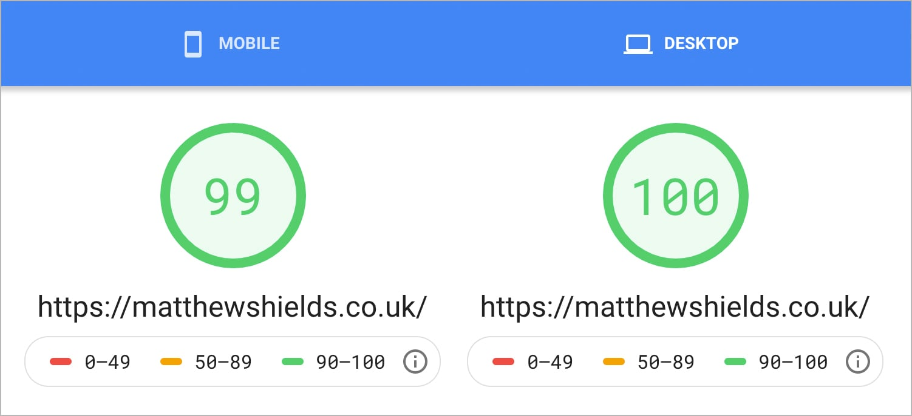

> **Disclaimer:** this isn't a guide to learning Gatsby, there are resources much better then I could provide for this, some of which I have linked to at the <a href="#useful-gatsby-links">bottom of this post</a>.

To give some context, I've used React on a few sites now, primarily ones which have been heavily API driven rather than traditional content based. I've always had some misgivings about the fact that there is no content delivered as part of the initial HTML document and purely rendered in browser. 

Working at an SEO agency I have seen several client sites be severely negatively impacted by React / Angular sites implemented incorrectly, something that I have always wanted to avoid (for obvious reasons), but I then became aware of the great work that Gatsby and the like have been doing.

Since hearing a lot about them I've been wanting to dive into JAMstack technologies for a while now and finally blocked off a weekend to dedicate myself to it. I've been to talks, read blogs, talked about it with people and planned out in my head. All that was missing was me getting my hands dirty and getting started. Here are some of the observations that I had during this process, there is a mix of positive, negative and just some unanswered questions for the time being. 

## The positives

Let's start off with the positives, because there were some great things that I really enjoyed about this development experience that I really want to talk about.

### Documentation as a priority

As more people are picking up a particular technology, documentation will be vital as their first point of contact for support. I have to commend the Gatsby team for the effort they have made into making their documentation top notch and accessible, even to someone new to it like myself. Between the documentation itself, showcase sites, tutorials, starter sites and the like there really are a wealth of resources to help you on your way.

### The power of the 'gatsby-image' component

I genuinely love this component. With lazy loading, service worker caching, src-sets and blurred base64 images built in, what's not to love? Images can be detrimental to performance of sites and this definitely makes it a lot easier to lessen this impact. I want to do some further investigation into this and make sure that I'm not taking it as a given that it is all pros and no cons but so far it seems to be working great.

### PageSpeed results

The foundations of how Gatsby works seem to be focused on optimisation in a way which is extremely compatible with the metrics that PageSpeed measures against. Without much intervention from myself, the performance of the site from a PageSpeed perspective was great. I need to take into consideration the size of the site that I am analysing, it is admittedly quite a basic site, but I'm in no doubt that the same could be achieved with a more complex site too.



### Built in powerful functionality for great user experience

Service workers for offline support, content and asset caching, automatic prefetch functionality to name a few. All of these were just, there. There is always a balance between configuring things yourself and letting someone do the heavy lifting for you, but in this case I've got to say I'm alright with it. I definitely want to pick it apart a bit more incase I need to do more custom configuration in the future but the basic setup seems like I wouldn't need to do that in most cases (I could be wrong!).

## Some issues that I ran into

As with picking up any new technology, especially when it has fundamental differences to something you have used before, you are going to hit some challenges as you learn. These aren't necessarily criticisms of the technology, but just things that I struggled with and have identified areas for me to keep learning further. I fully expect in time, if I was to write this post again in six months, I would be giving you a whole different list.

### 'gatsby-node' and 'gatsby-config' might take some getting used to

Theres nothing that different here in the configuration between this and plenty of other things that you may already be using, or have used, such as Grunt or Gulp. What I did find _personally_ with Gatsby was that these files were a bit unintuitive getting started as a newbie. I'm sure over time that I will get much more to grips with these setups but I will definitely need a few more rounds before I feel really comfortable.

### The number of images and their impact on build time

One thing that I found with Gatsby is that the number of images very quickly will impact the build time for your site. This makes sense when you look at how it works which was a big shift from what I am used to, but its definitely something to be aware of. I don't have that many images on my site yet but I very quickly found myself with a 15 minute build time on Netlify. The biggest tip I can give you on this one? Pre-optimise your images. I know this might seem like something that you want it to take care of, and it will, but with it being something that you need to repeat every time that you spin up locally or deploy you will get the rewards back in time.

For pre-optimising my images I just exported them at a reasonable size, ideally the maximum image size they would ever be displayed, and ran them through <a href="https://imageoptim.com/" target="_blank">imageoptim</a>. This then took my build process back down to three minutes, much better! I want to do more investigation with this one as I can see this creeping back up again as I add more images into my site, thanks to the photography section.

### GraphQL queries, do the research

GraphQL has been a learning curve. Its not its actually that complex to write, in fact its actually shockingly simple to write queries to fetch your content (in my case querying content from markdown files). There are however several gotchas that I got caught with as I was working on the site. In hindsight I wish I had put more time into researching and learning the concepts of graphQL beforehand. It is extremely powerful but I would say it's very strict. A few of the things I came across were:

* GraphQL queries may look like a string, but they're not and don't try to treat them as such
* Only page based queries have access to variables, no component based queries

### Images are expected to be siblings to the queried content

When querying images you will probably want to use the 'gatsby-image' component to render them, as previously discussed it's great, so why wouldn't you? Gatsby however will expect that images are siblings to the content that is being queried. This differs to NetlifyCMS where images are stored in a single assets directory, not an unreasonable thing with a content management system with the ability to upload images.

When I was doing _childImageSharp_ queries though this would return null, removing your ability to use this component. You could query as a string and display as an  tag, however the benefits would then be reliant on you to implement separately, luckily though someone has resolved this for you. Using the <a href="https://www.npmjs.com/package/gatsby-remark-relative-images" target="_blank">gatsby-remark-relative-images</a> plugin this will allow you to have your images in a singular directory and still use your _childImageSharp_ query. The page on NPM will show you how to configure the plugin, but it is incredibly easy. After that you can then query with relatively little difference to before as you can see below.

```javascript
export const query = graphql`
  query {
    fileName: file(relativePath: { eq: "matthew-shields.jpg" }) {
      childImageSharp {
        fluid(maxWidth: 800) {
          ...GatsbyImageSharpFluid_withWebp
        }
      }
    }
  }
`
```

## Conclusion

I have really enjoyed my first dive into this new approach to web development, I fought through the times where I knew I could have achieved certain bits in a fraction of the time in my traditional stack and to be honest with you, I'm proud of what I have put together.

This is only the first step, there's lots more for me to learn and am fairly certain that in a few months I will want to burn this site down and build it again from the ground up with what I have learnt, and that's OK. I will however be wanting to document this journey on here for anyone to see, and for me to reflect on as I go.

## Useful Gatsby links

* <a href="https://www.gatsbyjs.org/docs/" target="_blank">Gatsby Docs</a>
* <a href="https://www.gatsbyjs.org/tutorial/" target="_blank">Gatsby Tutorial</a>
* <a href="https://www.gatsbyjs.org/showcase/" target="_blank">Gatsby Showcase</a>
* <a href="https://www.gatsbyjs.org/starters/Vagr9K/gatsby-advanced-starter/" target="_blank">Gatsby Advanced Starter</a>
* <a href="https://graphql.org/learn/" target="_blank">Graphql.com Learn</a>
