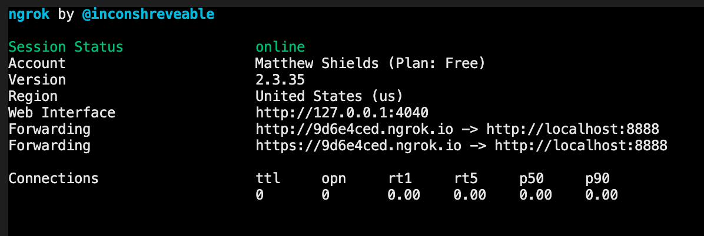

> **Disclaimer:** you will need to have ngrok configured on your machine for this approach to work, the person viewing the site doesn't need to have it set up though.
>
> There is a link to the ngrok documentation at the <a href="#related-links">bottom of this post</a>.

I wrote a post recently about how my team and I have been working to come up with a way to help each other [debug remotely](/remote-development-assistance-using-vs-code-liveshare), the important part being without the need to set up the site on each others' computer to do so. One of the important parts of this was having the ability to visit their local environment in your own browser.

This is quite easy to do with static sites, I have wrote about this too which you can read here, but it is a little more difficult with WordPress sites. WordPress will use the site URL stored in the database for a variety of things such as redirecting to it when visiting the site.

Additionally to this, with the way that WordPress works you tend to have absolute URLs prolific through the source code. Having absolute URLs will cause an issue when someone else views the site through their browser, as they may not have http://yourlocalsite.localhost configured on their machine and their browser won't be able to resolve it. 

These issues would cause problems if I tried to serve the site through ngrok without changing anything and you definitely don't want to be having to change the URLs in the database every time you want to share the site with someone.

## How to share local WordPress sites through ngrok

The solution that my team and I use deals with this in two ways. Firstly, by dynamically setting the `WP_SITEURL` and `WP_HOME` constants in the wp-config.php. Secondly, making any instances of the local site URL into a relative link, ensuring that they will still resolve when viewed through a different URL. This will also only need to be done once per site, so not a bad investment of a couple of minutes.

## Step One: Dynamically changing wp-config constants

I add this snippet into the wp-config.php, it detects if the URL that it's accessing contains ngrok in the host name before it does anything. If that is the case then it defines the `WP_SITEURL` and `WP_HOME` constants to the URL that is visiting it, taking care of the dynamic URL that ngrok creates. It then also sets a constant of `LOCALTUNNEL_ACTIVE` for use by the plugin that I will come to next.

```php
if(strpos($_SERVER['HTTP_X_ORIGINAL_HOST'], 'ngrok') !== FALSE) {
	if(
		isset($_SERVER['HTTP_X_ORIGINAL_HOST']) && 
		$_SERVER['HTTP_X_ORIGINAL_HOST'] === "https"
	) {
		$server_proto = 'https://';
	} else {
		$server_proto = 'http://';
	}
	define('WP_SITEURL', $server_proto . $_SERVER['HTTP_HOST']);
	define('WP_HOME', $server_proto . $_SERVER['HTTP_HOST']);
	define('LOCALTUNNEL_ACTIVE', true);
}
```

I personally use a split wp-config system with our sites meaning that I can add this only into my local wp-config.php file. I highly recommend that you have a look at how you can do this for your WordPress setup.

## Step Two: Making WordPress URLs relative

I created a plugin to make the URLs in the site relative. I ended up using the approach of creating a plugin which only ever does anything when it detects the `LOCALTUNNEL_ACTIVE` constant. The plugin ensures that the negative performance impact is limited to only local versions of the site when visited through an ngrok URL.

The plugin works by hooking to the start and end of the page creation and capturing it into an output buffer, it then uses the URL from the database for a str_replace, stripping it out before sending back out to the shutdown hook. This means that I can share either the HTTP or HTTPS versions of the ngrok URLs.

```php
function change_urls($page_html) {
  if(defined('LOCALTUNNEL_ACTIVE') && LOCALTUNNEL_ACTIVE === true) {

    $wp_home_url = esc_url(home_url('/'));
    $rel_home_url = wp_make_link_relative($wp_home_url);

    $esc_home_url = str_replace('/', '\/', $wp_home_url);
    $rel_esc_home_url = str_replace('/', '\/', $rel_home_url);

    $rel_page_html = str_replace($wp_home_url, $rel_home_url, $page_html);
    $esc_page_html = str_replace($esc_home_url, $rel_esc_home_url, $rel_page_html);

    return $esc_page_html;
  }
}

function buffer_start_relative_url() { 
  if(defined('LOCALTUNNEL_ACTIVE') && LOCALTUNNEL_ACTIVE === true) {
    ob_start('change_urls'); 
  }
}
function buffer_end_relative_url() { 
  if(defined('LOCALTUNNEL_ACTIVE') && LOCALTUNNEL_ACTIVE === true) {
    @ob_end_flush(); 
  }
}

add_action('registered_taxonomy', 'buffer_start_relative_url');
add_action('shutdown', 'buffer_end_relative_url');
```

This process is an inefficiency which I would not want to be happening all the time for my site, especially in production. By limiting the plugin to only perform its functionality when it detects this constant, it provides the ability to control when it happens.

The reason I decided to package this up as a plugin is purely for ease of installing and updating if I need to in the future, however this could equally be added into my functions.php as an alternative.

Hat tip to <a href="https://sparanoid.com/work/relative-url/" target="_blank">https://sparanoid.com/work/relative-url/</a> for the lead of how to approach this, however I didn't want to have this applied all the time or risk it ending up on production.

## Step Three: Creating the localtunnel

With the way that our team have our WordPress sites set up, I need to send through the host name of the site that we use locally as well as the port number and this will then direct the traffic to my local site. This works whether I had created it, or using something like MAMP Pro to set this up for me.

```
~/ngrok http -host-header=sitename.localhost 8888
```

Once ngrok is up and running I will be presented with the display that you can see below, giving me the URLs that I need to share. I will need to keep this terminal window open for the length of time I want the localtunnel open, so I need to not close it until I mean to, but also be nice to the ngrok service and close it when I'm not currently needing it, I can always open another one.



And thats it, I now have the ability to share WordPress sites dynamically through ngrok with anybody, without any setup required on their machines. I hope this approach might inspire you or help with any remote debugging or sharing needs that you have, especially at the moment when so many of us are working from home.

## Related Links

* <a href="https://ngrok.com/docs#getting-started" target="_blank">ngrok documentation</a>
* [Guide to sharing local static sites remotely using ngrok](/sharing-local-static-sites-remotely-using-ngrok)