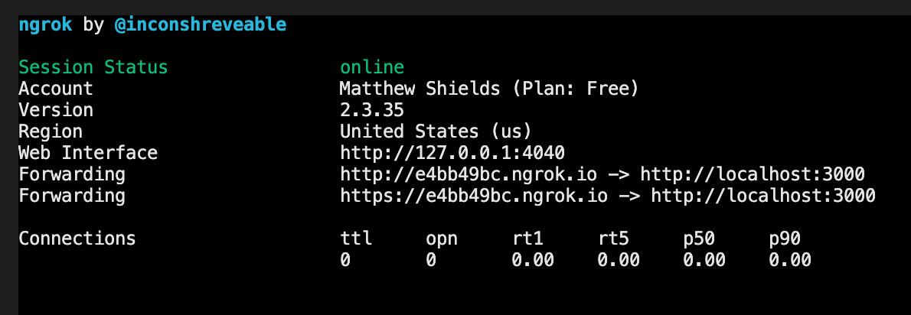

> **Disclaimer:** you will need to have ngrok configured on your machine for this approach to work, the person viewing the site doesn't need to have it set up though.
>
> There is a link to the ngrok documentation at the <a href="#related-links">bottom of this post</a>.

Like most development teams around the world at the moment, my team are transitioning from an office environment to all working remotely. I wrote a [post](/remote-development-assistance-using-vs-code-liveshare) recently about the need we had to be able to debug remotely, an important part of which is being able to see the site in browser with absolute minimal setup.

I work on around a 50/50 split between static sites and CMS sites, most of which use WordPress. I have written about how you can [share a WordPress site remotely](/sharing-local-wordpress-sites-remotely-using-ngrok), which requires a little bit more work, but for most static site setups using ngrok to open a tunnel is very straight forward.

## Creating the tunnel

There are two different local static site setups that I have used:

* Static site using `grunt-browser-sync` which creates a localhost server with a dynamic port number
* Static site using a static hostname and port number

Whichever kind of site I am wanting to share though ngrok makes this incredibly easy to set up and use.

### Static site using a localhost server and dynamic port number

When using a package like browser-sync (where it creates you a local URL such as http://localhost:3000), you can expose this URL publicly with the following command in your terminal. The only dynamic part of this would be the port number that you would like to expose.

```
~/ngrok http 3000
```

By default ngrok will assume the hostname is 'localhost', if this isn't the case then please use the next example.

### Static site using a static hostname and port number

When your local site has a static host name and port number, you will need to pass this to the ngrok command in this format. A nice simple one-liner! 

```
~/ngrok http -host-header=sitename.localhost 8888
```

### Sharing the remotely accessible

Whichever option from above you use, you will be presented with this when the ngrok tunnel is successfully open, giving you the URLs that you can share. This terminal window will need to remain open for the length of time you want the tunnel to remain open, so don't close it until you mean to. Please bear in mind that this is probably a free service that you are using, remember to close it when not needing it. You can always open another one later.



You now have a publicly shareable tunnel through to your static local site, something that can be really helpful for remote debugging or checking in with the design team. I hope this helps and if you have any other local static site setups not covered by these two then let me know and I will update the post.

## Related Links

* <a href="https://ngrok.com/docs#getting-started" target="_blank">ngrok documentation</a>
* [Guide to sharing local WordPress sites remotely using ngrok](/sharing-local-wordpress-sites-remotely-using-ngrok)