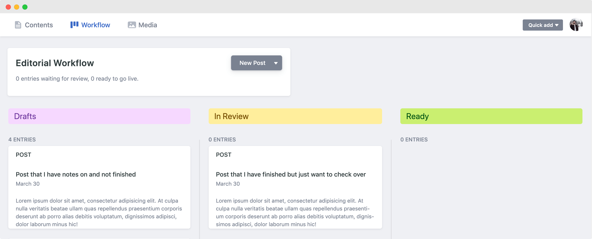

* I want to talk about how I have set up my netlify CMS
* Media folders per post type
* editorial workflow
* Navigation management

As a new user of Netlify CMS and the JAMstack approach I've been blown away by the power behind this simple to use static CMS.

If you aren't aware of Netlify CMS it is a static single page React application , no-database content management system, which works through the creation and editing of files in Markdown, YAML or JSON to name a few options. This is a perfect partner when it comes to any number of static site generators like Gatsby, Jekkyl or NextJS thanks to their platform agnostic approach.

## Simple but configurable

The Netlify CMS documentation gives you a great breakdown of <a href="<https://www.netlifycms.org/docs/start-with-a-template/>" target="_blank">how to get started</a> and even a few templates for a few different site types, super helpful. So far, my entire configuration of Netlify has happened just in its config.yml file, a mark of its simplicity to pick up. There are additional areas that you may need to touch if you were to create your own Netlify CMS widgets but thats something that I'm yet to attempt but will write it up on here when I do!

## Editorial Workflow

I don't use this feature while in the initial build phase as it slows me down, but as soon as I'm dealing with a live site I love this feature. What this does is that it will create an individual branch so each piece of content that you write and allow you to save as a draft. You can enable this feature by adding this line into your config.yml file:

```yaml
publish_mode: editorial_workflow
```

Once you have done that you will see some more options appear in your site admin. When viewing your posts you will actually only see the ones that have been fully published, to see your in progress content you will need to go to Workflow. You now get 3 different states before you can actually publish.



If you happen to be using Netlify for your hosting (which I would very much recommend) and are on the free tier, just be aware that you may want to check the settings that you have for when it comes to deploy previews, a fantastic feature but depending on the scale of updates that you are making you might not want to use up all those build minutes!

What I have done for this is I have