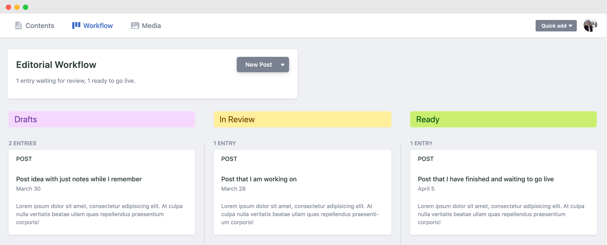

As a new user of Netlify CMS and the JAMstack approach, I've been blown away by this simple to use static CMS.

If you aren't aware of Netlify CMS it is a no-database content management system, accessed through a single page React application, which works through the creation and editing of files in Markdown, YAML or JSON to name a few options. This is a perfect partner when it comes to any number of static site generators like Gatsby, Jekkyl or NextJS thanks to their platform agnostic approach.

I would call out that Netlify CMS is not going to be powerful enough for a complex site. If you are after a CMS to power your personal site or some brochureware though, with the aim being making it easier to manage your static content, then I would definitely add it into your options to look at.

## Simple but configurable

The Netlify CMS documentation gives you a great breakdown of <a href="<https://www.netlifycms.org/docs/start-with-a-template/>" target="_blank">how to get started</a> and even a few templates for a few different site types, super helpful. So far, my entire configuration of Netlify has happened just in its config.yml file, a mark of its simplicity to pick up. There are additional areas that you may need to touch if you were to create your own Netlify CMS widgets or previews, but thats something that I'm yet to attempt but will write it up on here when I do!

## Editorial Workflow

I didn't use this feature while in the initial build phase as it slows me down, but as soon as I was dealing with a live site I loved this feature. What this does is that it will create an individual branch so each piece of content that you write and allow you to save as a draft. You can enable this feature by adding this line into your config.yml file:

```yaml
publish_mode: editorial_workflow
```

Once you have done that you will see some more options appear in your site admin. When viewing your posts you will actually only see the ones that have been fully published, to see your in progress content you will need to go to Workflow. You now get 3 different states before you can actually publish - 'Drafts', 'In Review' and 'Ready'. Once you have marked a post as being 'Ready' you will then be able to publish it, where it will be merged back into the main branch. Super easy to use but for someone like me who never writes in a single go is pretty essential to have them tucked away somewhere till I'm finished.



For my personal site, I use this to organise my notes of ideas for posts, posts that I am actively working on and ones that are ready to be published, but this might differ if you actually have a team and an editorial process!

## Editorial Workflow and Git

If you happen to be using Netlify for your hosting (which I would very much recommend) and are on the free tier, just be aware that you may want to check the settings that you have for when it comes to deploy previews, a fantastic feature but depending on the scale of updates that you are making you might not want to use up all those build minutes. (Or do what I plan to as soon as I can and pay for more, but this isn't an option for everyone!)

By default editorial workflow will branch off and merge back into master, you can however change this if you want by adding the *branch* definition to the config.yml file. I'm currently using a pre-production branch for mine so that I can prepare multiple commits into a single pull request for auto-deployment. This is also helpful as I am currently making a lot of additions to the CMS (and refactoring) currently.

```yaml
backend:
  name: github
  repo: MatthewShields/matthewshields.co.uk
  branch: pre-production # Choose the branch to update
```

## Main Navigation

There isn't a built in menu manager which you will be used to getting with most CMS. You can create a collection type of Settings which gives you a place to store this type of information separate to your content but also still administrated vis the CMS. In the case of a single layer navigation a List widget will be enough to do this.

```yaml
  - name: settings
    label: Settings
    files:
      - file: data/settings/navigation.yml
        label: Navigation
        name: navigation
        fields:
          - label: Navigation
            name: nav_items
            widget: list
            fields:
              - {label: Label, name: label, widget: string}
              - {label: Path, name: path, widget: string}
```

You can then load the YAML data directly into the component that needs it in order to build your navigation, independent of page context or other things. (Simplified example below)

```javascript
import YAMLData from "../../../data/settings/navigation.yml"

class Header extends Component {
  render() {
    return (
      <ul>
        {YAMLData.nav_items.map((data, index) => {
          return (
            <li className="main-nav__item">
              <Link to={data.path}>{data.label}</Link>
            </li>
          )
        })}
      </ul>
    );
  }
}

export default Header;
```

## Media Folders Per Collection

When starting off with Netlify CMS I was using a singular assets directory for all collections and storing the images in my static directory like below. This started causing limitations and difficulties though when wanting to use *gatsby-image*, which when the content and image sit side by side in the same directory is beautifully easy.

```yaml
media_folder: static/assets
public_folder: assets
```

If you are also dealing with Gatsby, or an alternative with the same issue, I recommend that you configure it to store the images for each collection relative to each collection. This will mean that images are stored alongside the content markdown files. To do this when you are creating your collection in config.yml, define *media_folder* and *public_folder* with these values. If you have any previously uploaded image you will need to move them into the new directory.

```yaml
collections:
  - name: blog
    label: "Post"
    folder: "content/writing"
    media_folder: ''
    public_folder: ''
    create: true
    slug: "{{year}}-{{month}}-{{day}}-{{slug}}.md"
    fields:
      - { label: "Title", name: "title", widget: "string" }
      - { label: "Body", name: "body", widget: "markdown" }
```

This however does mean that if you have uploaded an image to another collection previously, these images aren't accessible globally, so if you wanted to use it in a different collection you would have to upload again. In the case of the benefits I got from configuring it this way for use with Gatsby though, this issue is insignificant in comparison.

## Post Type Hidden Value

One thing that I found useful, but cost nothing really, was adding a hardcoded hidden value into the content files to mark out what collection they came from. I've ended up using these values in a couple of way such as filtering the nodes in my gatsby-config.js, so for a one liner in your config why not add it in from the start.

```yaml
  - name: blog
    label: "Post"
    folder: "content/writing"
    media_folder: ''
    public_folder: ''
    create: true
    slug: "{{year}}-{{month}}-{{day}}-{{slug}}.md"
    fields:
      - { label: "post_type", name: "post_type", widget: "hidden", default: "post" }
      - { label: "Title", name: "title", widget: "string" }
      - { label: "Body", name: "body", widget: "markdown" }
```

## Conclusion

These are my top five configuration tips starting off with Netlify CMS. I hope to come back and do a follow up post in the future if I have any updates, and have another one in the works where I dig into using the beta feature of Variable Types with Gatsby (not as easy as I first thought!).

One of the things I have loved about Netlify CMS, that I know I have already mentioned, is it's simplicity. This is probably one of the main reasons that this isn't an essay of a post. It really just gives you what you need for basic content administration in the quickest way possible.

Are there any options you think I have missed or improvements that I can make? Please let me know at <a href="<https://twitter.com/MattShieldsDev>" target="_blank">Twitter</a>