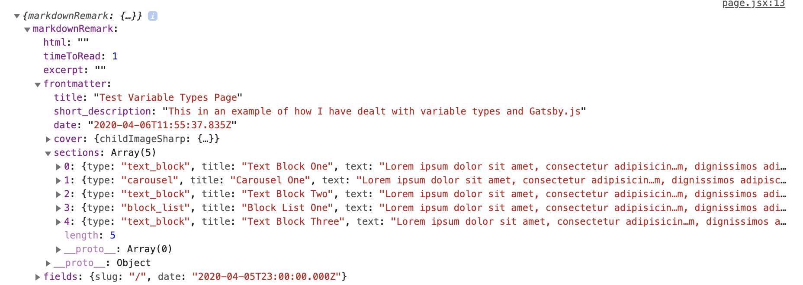
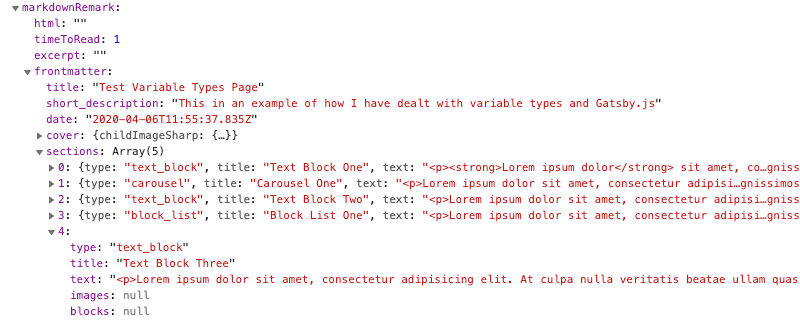

> I have created a <a href="https://github.com/MatthewShields/demo-gatsby-netlify-variable-types" target="_blank">simplified repository</a> based off of the <a href="https://www.gatsbyjs.org/starters/vagr9k/gatsby-advanced-starter/" target="_blank">gatsby-advanced-starter</a> with a working example of this which might be helpful to refer to.

**This post will cover:**

* [Setting up Variable Types fields in Netlify CMS](#introducing-netlify-cms-variable-types)
* [Defining field types in Gatsby using createSchemaCustomization API](#using-createschemacustomization-api-and-createtypes-to-define-field-content-type)
* [Querying Variable Type fields in GraphQL](#building-your-graphql-query)
* [Formatting markdown content with createFieldExtension](#its-all-markdown-hill-from-there)
* [Displaying Variable Type queried data in React](#flexible-content-in-react)

## My issue: The static nature of my Netlify CMS content

I have historically worked with WordPress for my CMS sites and love the flexibility provided to me by using Advanced Custom Fields, more specifically with it's *'Flexible Content'* approach. This allows you to build pages using any combination of components as required, without resorting to using inefficient page builder plugins.

When building version one of my site I knew I wanted pages to have different content on them. For these bespoke pages I actually made them using a template file for each one. Longer term, I don't want to do this - if I have a CMS then I'm going to use the CMS. Not every project can have someone making a new file for every page creation after all.

> **TL;DR** - I want to use the Netlify CMS to be able to piece together pages with a flexible use of components, without creating new template files for each combination still being built with Gatsby.js

## Introducing Netlify CMS Variable Types

After looking into the widget types built into Netlify CMS I couldn't find anything that quite catered for my needs. The closest was 'List' which gives you the ability to add a repeatable set of fields, but these fields are static and the same for each repetition. I could use 'List' and add every instance of field along with ability to pick which component to use, but as there isn't any conditional logic, this would become awful to use really fast.

On the Netlify CMS site they have a list of their beta features and in there I found exactly what I was after, <a href="https://www.netlifycms.org/docs/beta-features/#list-widget-variable-types" target="_blank">variable types</a>. This feature provides the ability to use a repeater like with 'List' but assign different fields to each type.

Variable types was straight-forward to set up once I knew that it existed. Unfortunately, that came after a couple of hours of trying to build my own version of the ACF flexible content functionality as a Netlify CMS custom widget. But that's given me ideas for another challenge so nothing wasted!

```yaml
 
collections:
  - name: pages
    label: "Page"
    folder: "content/pages"
    media_folder: ''
    public_folder: ''
    create: true
    slug: "{{year}}-{{month}}-{{day}}-{{slug}}.md"
    fields:
      - { label: "post_type", name: "post_type", widget: "hidden", default: "page" }
      - { label: "Title", name: "title", widget: "string" }
      - { label: "Short Description", name: "short_description", widget: "string" }
      - { label: "Publish Date", name: "date", widget: "datetime" }
      - { label: "Cover Image", name: "cover", widget: "image", required: false }
      - { label: "Slug", name: "slug", widget: "string" }
      - label: 'Page Section'
        name: 'sections'
        widget: 'list'
        types:
          - label: 'Text Block'
            name: 'text_block'
            widget: object
            fields:
              - { label: Title, name: title, widget: string }
              - { label: Text, name: text, widget: markdown }
          - label: 'Carousel'
            name: 'carousel'
            widget: object
            fields:
              - { label: Title, name: title, widget: string }
              - { label: Text, name: text, widget: markdown }
              - label: 'Images'
                name: images
                widget: list
                fields:
                  - { label: "Image", name: "image", widget: "image", required: false }
                  - { label: Image Description, name: alt, widget: string }
          - label: 'Block List'
            name: 'block_list'
            widget: object
            fields:
              - { label: Title, name: title, widget: string, required: false }
              - { label: Text, name: text, widget: markdown, required: false }
              - label: 'Blocks'
                name: blocks
                widget: list
                fields:
                  - { label: Title, name: title, widget: string }
                  - { label: Text, name: text, widget: markdown }
```

This then gives me the exact ability I wanted in the CMS as you can see above. Half the challenge done, now  to get this back into my Gatsby build and into the site. 

## How to get the variable data with GraphQL?

The next step was figuring out how the GraphQL query would work with it, with the fact I don't know what fields a given page would be querying, as I wouldn't know which components had been used. Initially I thought this would be quite simple and queried for all fields across all of the various types, and it worked (for a while). Where this quickly fell down though, was that if there wasn't at least one page with an instance of a given type, Gatsby couldn't infer what type of data should be present.

A solution to this could be to have a page that had an example of all components on it, but that isn't something you want your site to be dependent on. If you were to add a new type or accidentally remove one of them your site is going to be unbuildable.

## Using createSchemaCustomization API and createTypes to define field content type

What you can do to get around this issue properly is use Gatsby's <a href="https://www.gatsbyjs.org/docs/schema-customization/#creating-type-definitions" target="_blank">*createSchemaCustomization API*</a> to manually define what content type Gatsby should expect from a given field, rather than it requiring it to exist to be inferred. Honestly, I found the Gatsby documentation a little confusing on this one and it took me a while to get it but once you have it up and running it makes sense. 

You can use this API in the gatsby-node.js file. You will need to make a call to the *createSchemaCustomization API* and define each of your fields (taking care to make sure that you note which of your fields are repeatable, i.e. List widgets), as you will need to define these as expecting to be arrays. Heads up here to remember that you are working in your gatsby-node.js file, there isn't the hot-reloading like most of the project so don't forget that you will need to restart when you make changes.

Given my example config.yml from above and the resulting <a href="https://raw.githubusercontent.com/MatthewShields/demo-gatsby-netlify-variable-types/master/content/pages/2020-04-06-test-variable-types-page.md.md" target="_blank">markdown file</a> I have structured my type definitions like so:

* **MarkdownRemarkFrontmatter** - I tell it to expect an array of the fields as defined in *Sections.*
* **Sections** - I tell this to expect the fields that I have used in my config.yml - note that you are defining the actual fields, I recommend referring to your created markdown file when doing this.
* **List Widget fields** - When a List widget has been used I define these fields in their own type definition, where they can then be included within the square brackets to tell Gatsby to expect an array.

```javascript
exports.createSchemaCustomization = ({ actions }) => {
    const { createTypes } = actions
    const typeDefs = `
  
      type CarouselImages {
        image: File
        alt: String
      }
      
      type BlockList {
        title: String
        text: String
      }
  
      type Sections {
        type: String
        title: String
        text: String
        images: [CarouselImages]
        blocks: [BlockList]
      }
  
      type MarkdownRemarkFrontmatter {
        sections: [Sections]
        cover: File @fileByRelativePath
      }
  
    `
    createTypes(typeDefs)
  }
```

## Building your GraphQL query

Now that we have our type definitions in place we can build the query for the page. I preferred building this using fragments which made it a lot easier for me to organise these in my mind, ensuring that I have the fields that I wanted for each variable type. Don't worry if you have duplicate fields in each fragment, such as *title* or *text*, these will be compiled into a single query.

```javascript
export const pageQuery = graphql`

  fragment Carousel on Sections {
    type
    title
    text
    images {
      image {
        childImageSharp {
          fluid(maxHeight: 700, quality: 100) {
            ...GatsbyImageSharpFluid_withWebp
          }
        }
      }
      alt
    }
  }

  fragment TextBlock on Sections {
    type
    title
    text
  }

  fragment BlockList on Sections {
    type
    title
    text
    blocks {
      title
      text
    }
  }

  query PageBySlug($slug: String!) {
    markdownRemark(fields: { slug: { eq: $slug } }) {
      html
      timeToRead
      excerpt
      frontmatter {
        title
        short_description
        date
        cover {
          childImageSharp {
            fluid(maxHeight: 700, quality: 100) {
              ...GatsbyImageSharpFluid_withWebp
            }
          }
        }
        sections {
          ...TextBlock
          ...Carousel
          ...BlockList
        }
      }
      fields {
        slug
        date
      }
    }
  }
  
`;
```

When this query is returned I have an array of objects, one for each entry of a variable type, as you can see in this screenshot. Perfect! We now have a flexible query that will handle as many instances as needed, in any order or without all types being present. Just what I needed!



## It's all Markdown-hill from there

The eagle eyed of you might notice the lack of HTML formatting within the text field, at this point it's returning the raw markdown content, this is less than ideal but luckily can be resolved, using... Field Resolvers (ba dum tsh). What we will first need to do is install the package <a href="https://www.npmjs.com/package/remark-html" target="_blank">remark-html</a>:

```bash
npm install remark-html
```

Then, include a couple of modules that will help convert the markdown into the HTML we want:

```javascript
const remark = require(`remark`)
const html = require(`remark-html`)
```

Finally, return back to the *createSchemaCustomization* function in the gatsby-node.js file from earlier. Using the example from Gatsby's documentation you can see how to add a new field extension that will take the input of the field content, convert from markdown and then return the final HTML. Once your field resolver is created you can then indicate which fields to use it on by appending @md to the expected field type.

```javascript
exports.createSchemaCustomization = ({ actions }) => {
  actions.createFieldExtension({
    name: "md",
    args: {
      sanitize: {
        type: "Boolean!",
        defaultValue: false,
      },
    },
    extend(options, prevFieldConfig) {
      return {
        args: {
          sanitize: "Boolean",
        },
        resolve(source, args, context, info) {
          const fieldValue = context.defaultFieldResolver(
            source,
            args,
            context,
            info
          )
          const shouldSanitize =
            args.sanitize != null ? args.sanitize : options.sanitize
          const processor = remark().use(html, { sanitize: shouldSanitize })
          return processor.processSync(fieldValue).contents
        },
      }
    },
  })

  const { createTypes } = actions
  const typeDefs = `

    type CarouselImages {
      image: File @fileByRelativePath
      alt: String
    }
    
    type BlockList {
      title: String
      text: String @md
    }
  
    type Sections {
      type: String
      title: String
      text: String @md
      images: [CarouselImages]
      blocks: [BlockList]
    }

    type MarkdownRemarkFrontmatter {
      sections: [Sections]
      cover: File @fileByRelativePath
    }

  `
  createTypes(typeDefs)
}
```

I'm definitely interested in finding out more about field resolvers as they seem like they could be really powerful and helpful in the future. For this particular issue (as below) we are now getting our fully formatted HTML returning and ready to be used. What you will notice is that each item in the array will have all the possible fields included in it, i.e. *text_block* will also have *images* as part of it, however the value will be *null* so we can work with that.



## Flexible Content in React

Now we have a working GraphQL query we actually want to use it in React. To do this we will need a component that we can pass *sections* into. This will then figure out what component type we are wanting to use and pass the individual fields into it to display on the front end.

To do this I created a new component of FlexibleContent which takes the sections input, loops through it and then uses a switch function to determine which component to use. Passing the fields that each component requires also means that it doesn't matter about the *null* unnecessary fields as the component won't be doing anything with them. 

By passing the fields individually rather than passing the entire object, it also means that the components will be easier for us to use outside of the content of the FlexibleContent loop. This will help ensure consistency across your site.

### FlexibleContent Component

```javascript
import React from "react";
import TextBlock from "../TextBlock/TextBlock";
import BlockList from "../BlockList/BlockList";
import Carousel from "../Carousel/Carousel";

class FlexibleContent extends React.Component {

  choose_section(section) {
    switch(section.type) {
      case 'text_block':
        return (
          <TextBlock title={section.title} text={section.text} />
        )
        break;
      case 'block_list':
        return (
          <BlockList title={section.title} text={section.text} blocks={section.blocks} />
        )
        break;
      case 'carousel':
        return (
          <Carousel title={section.title} text={section.text} images={section.images} />
        )
        break;
      default:
        // code block
    }
  }

  render() {
    let sections = this.props.sections;
    return (
      <div>
        {sections.map((section, index) => (
          <div className="content-block" key={section.type+'_'+index}>
            {this.choose_section(section)}
          </div>
        ))}
      </div>
    );
  }
}

export default FlexibleContent;
```

### Using the FlexibleContent Component

```javascript
import React from "react";
import { graphql } from "gatsby";
import Layout from "../layout";
import FlexibleContent from "../components/FlexibleContent/FlexibleContent";

export default class PageTemplate extends React.Component {
  render() {
    const { data, pageContext } = this.props;
    const postNode = data.markdownRemark;

    return (
      <Layout>
        <FlexibleContent sections={postNode.frontmatter.sections} />
      </Layout>
    );
  }
}
```

## Gatsby and Variable Types - One Happy Family

And there we have it, the ability to be able to flexibly build out pages using Netlify Variable Types and a single page template. This is actually powering most of the pages of my site and am looking at building out the component collection over time. I hope that this helps any of you struggling to pick up using Variable Types for the first time, I was really struggling to find any guides with how to use it with Gatsby specifically. I feel like this is my first big challenge overcome in taking this into being able to use with client projects.

If there are any issues or improvements you can feel free to make a pull request to my demo repo or get in touch with me on <a href="https://twitter.com/whatsthatweasel" target="_blank">Twitter</a>, and I will update this post over time too.